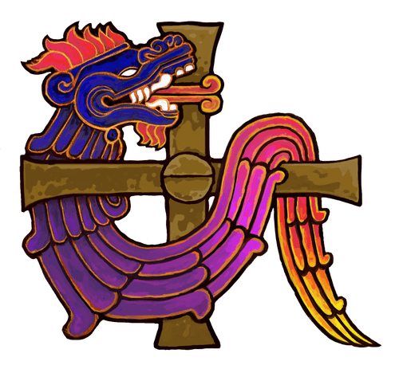

# 🔮 Mythical Beings: A Strategic Card Game of Wisdom and Elemental Power



Enter a world where legendary creatures wield elemental knowledge. Build a team, rotate your beings to gather wisdom, and unleash powerful effects to outmaneuver your opponent.

— Learn the rules in minutes. Master them over many duels.

## What Is Mythical Beings?

Mythical Beings is a fast, tactical, turn-based card game for two players. Each player commands three creatures (mythical beings) and equips them with Knowledge cards (spells/skills) from the Market. Rotate beings to gain wisdom and pay knowledge costs, trigger card effects and passives, and whittle down your opponent’s power to win.

## Objective

- Reduce your opponent’s power to 0.
- If both players reach 0 power or less simultaneously, the game is a draw.

## Components At A Glance

- Creatures: Your three beings on the battlefield. Each has a passive ability and gains wisdom by rotating.
- Knowledge Cards: Elemental cards (Aquatic/Water, Terrestrial/Earth, Aerial/Air). Played onto a specific creature’s slot. Each has a cost, an effect that depends on rotation, and eventually leaves play after a number of rotations.
- Market: The shared row where players draw knowledge from.
- Power: Your life total. When it reaches 0, you lose.
- Hand: Knowledge cards you’re holding (max size 5).

## Turn Structure (2 Actions Per Turn)

Every turn flows through clear phases:

1) Knowledge Phase
- All knowledge cards on the field rotate +90°.
- Their effects trigger according to the card’s value cycle (see below).
- Cards that reach their final rotation leave play (discard). “Leaves play” can trigger passives.

2) Action Phase
- You have 2 actions by default. Typical actions:
  - Draw 1 knowledge from the Market (if space in hand).
  - Summon 1 knowledge from your hand onto one of your creatures.
  - Rotate one of your creatures 90° to change its wisdom.
  - End Turn (always allowed when it’s your turn).

3) End Turn
- Any end-of-turn effects resolve. Turn passes to your opponent.

Notes
- You can’t take actions if it’s not your Action Phase.
- Some passives can make specific summons free (don’t consume actions) or modify normal rules.

## Core Mechanics

Creatures and Wisdom
- Each creature has a current wisdom value determined by its rotation (wisdom cycle).
- Wisdom pays the cost to summon knowledge onto that creature’s slot.

Summoning Knowledge
- A creature may hold at most one knowledge card on its slot.
- To summon: the creature’s current wisdom must be ≥ the knowledge cost.
- Knowledge replacement is not allowed: you can’t summon onto an occupied slot.
- Some slots may be blocked by effects (you can’t summon there while blocked).

Rotation & Value Cycles
- Each knowledge has a valueCycle, mapping rotation (0°/90°/180°/270°) to the effect’s strength or behavior.
- During the Knowledge Phase, the effect uses the pre-increment rotation to determine values, then rotates +90°.
- After a number of rotations (maxRotations), the knowledge leaves play (goes to discard).

Leaves Play Triggers
- When a knowledge leaves play, some creatures’ passives react. Example: Lisovik deals 1 damage to the opponent when its owner’s earth knowledge leaves play.

Damage, Defense, and Power
- Many effects deal damage directly to the opposing player’s power.
- Some knowledge provides defense or modifies how damage is applied.
- If multiple effects/passives trigger, the game resolves them deterministically and logs the sequence.

Market & Hand
- Draw from the Market into your hand (max hand size: 5).
- The Market refills according to the game rules (see logs/effects for specifics in edge cases).

## Example Turn

Setup: You control Lisovik and two other beings. You’ve summoned an Earth knowledge onto one creature.

1) Knowledge Phase
- Your Earth knowledge triggers at its current rotation and then rotates. If it reaches its final rotation, it’s discarded. If it was yours and Earth, Lisovik may deal 1 damage on leave.

2) Action Phase (2 actions)
- Action 1: Rotate your second creature to gain wisdom.
- Action 2: Summon an Air knowledge from your hand (you meet the cost thanks to the rotation).

3) End Turn
- Any pending effects resolve. It’s now your opponent’s turn.

## Passives & Signature Interactions (Examples)

- Lisovik (Earth synergy): When your Earth knowledge leaves play, deal 1 damage to the opponent.
- Kappa: Summoning Aquatic knowledge can be a free action on Kappa (does not consume actions).
- Dudugera: Summoning onto Dudugera can be free (specific conditions apply).
- Zhar-Ptitsa: Start-of-turn draw; aerial damage may bypass defense in specific checks.
- Tarasca: Punishes opponents when they summon terrestrial knowledge.
- Lafaic: Rotates another friendly knowledge when you summon Aquatic onto Lafaic.

These examples illustrate how passives shape your plan: time rotations, line up leaves-play triggers, and pressure your opponent’s power.

## Strategy Tips

- Plan around rotations: many effects peak at specific angles. Don’t waste a strong tick.
- Prepare for leaves-play: set up passives that benefit when your cards rotate out.
- Deny the opponent: block, discard, or rotate their board to disrupt timing.
- Hand discipline: keep space for pivotal Market draws (max 5).

## Learn the Cards

- Rulebook PDF: public/RULEBOOK.pdf (visual reference of creatures and knowledges)
- Digital rules (matches engine): docs/rules/RULES.md
- Tests as specs: the tests in `tests/gameReducer` document edge cases and intended behaviors.

## Play Locally

Prerequisites
- Node.js 18+
- npm (or yarn)

Install & Run
```bash
git clone https://github.com/YourUsername/CardGame.git
cd CardGame/mythical-beings-mvp
npm install
npm run dev
```

Environment
Create a `.env.local` in the project root (see `.env.example`):
```
VITE_SUPABASE_URL=your_supabase_url
VITE_SUPABASE_ANON_KEY=your_supabase_anon_key
VITE_POLYGON_RPC_URL=your_polygon_rpc_url
VITE_POLYGON_CHAIN_ID=137
VITE_GEM_CONTRACT=0x5f790ffa0695967a2d711872ecb4c7553e24794d
VITE_CARDS_CONTRACT=0xcf55f528492768330c0750a6527c1dfb50e2a7c3
VITE_WISDOM_DUEL_ESCROW_ADDRESS=0x4DF3B86B9b1332779d8EAE7c276BcC1bDe2e19e9
```

For competitive GEM matches, configure the matching Supabase Edge Function secrets listed in `.env.example`.

Useful Commands
```bash
# Run development server
npm run dev

# Build for production
npm run build

# Run tests
npm test

# Reset a test game (for development)
node reset-game.js

# Verify authentication implementation
./apply-auth-profile-sync.sh
```

## Project Structure (Short)

- src/game: core rules, state, actions, effects, passives
- src/components: UI components (Card, CreatureZone, Market, etc.)
- src/pages: app screens (Home, Lobby, GameScreen, etc.)
- tests: comprehensive unit/integration tests for rules, effects, passives

## Contributing

Contributions are welcome! Open an issue or PR with a clear description, and include tests for logic changes.

1) Fork the project
2) Create a feature branch: `git checkout -b feature/your-feature`
3) Commit: `git commit -m "Add your feature"`
4) Push: `git push origin feature/your-feature`
5) Open a Pull Request

## License

MIT — see LICENSE.

## Acknowledgements

- Inspired by global folklore and mythologies
- Thanks to contributors, playtesters, and artists

<p align="center"><em>May the wisest being win! 🏆</em></p>
